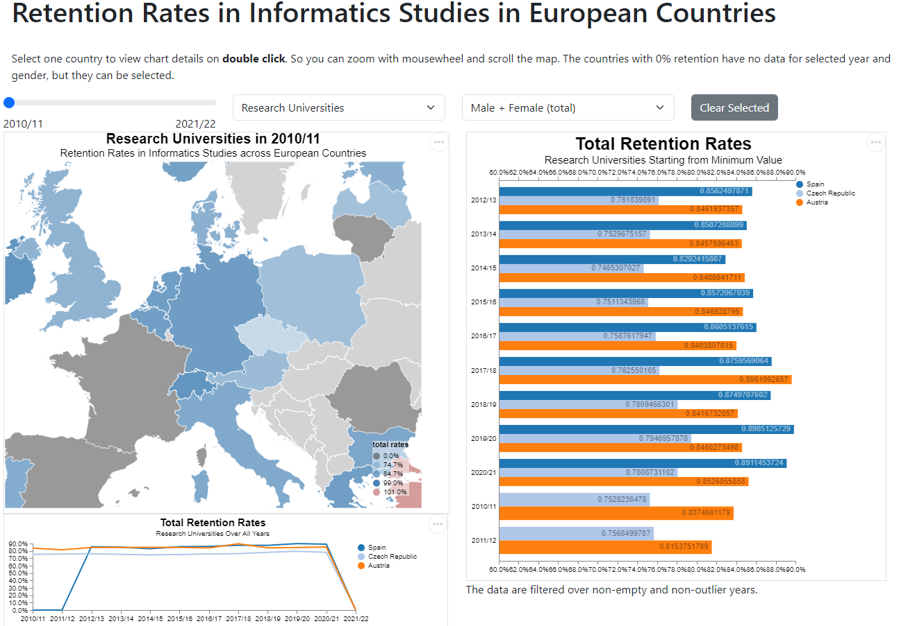

# Mapping Retention Rates in Informatics Studies across European Countries

It features an interactive map displaying retention rates, allowing users to explore data by hovering over each country. Additionally, there are two dynamic charts providing further insights into retention trends. Overall, the visualization offers a comprehensive view of informatics study retention across Europe, facilitating easy comparison and analysis.

## How it looks like?




### How to convert data from excel (optional)
If you want to use similar data to use this visualization. Try to edit `retention_model1_json_convert.py`


- install dependencies
```
pip install -r requirements.txt
```
- run the modified script
```

python retention_model1_json_convert.py --model 2 -i  "./data/Bachelor-Data-Retention-Graduation.xlsx"
```

data for visualization should match `./retention_schema.json` file.